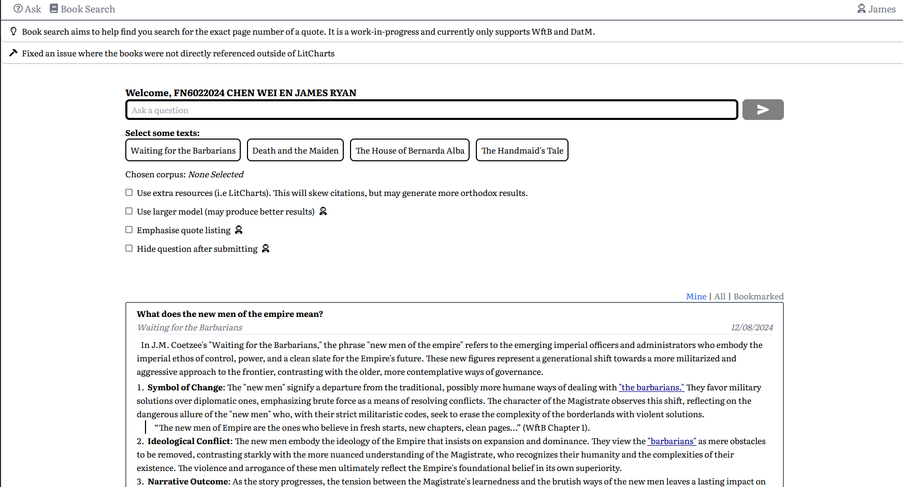

# Bookance - Get quotes for your literature text

Bookance is little next.js webapp that allows high school students to ask questions about literature.

Users are able to do the following:
- Ask questions about texts (i.e "What are some examples of symbolism in Dorfman's Death and the Maiden) and get a response with quotes
- Identify quotes in responses to find the larger context
- Do partial text lookups on works, and find the page number